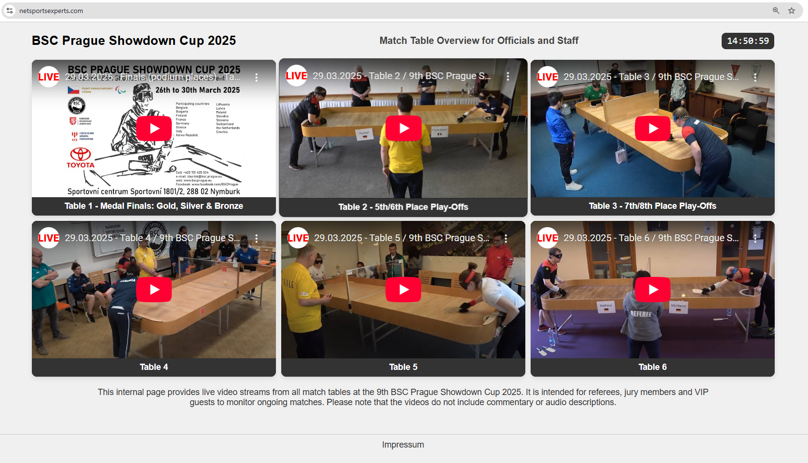

# Showdown Stream Overview

**Livestream-Übersicht für den 9. BSC Prague Showdown Cup 2025 in Nymburk, Tschechien**

Diese minimalistische Web-Oberfläche zeigt alle Livestreams der Tische auf einer Seite – perfekt für Schiedsrichter, Jury und VIP-Gäste.  
Kein Schnickschnack, aber eine laufende Uhr, klare Struktur und einfache Anpassung über eine Liste mit YouTube-IDs.

---

## 🏓 Hintergrund

Entstanden anlässlich des 9. BSC Prague Showdown Cups 2025.  
Das Ziel: Eine interne Übersicht aller laufenden Matches – möglichst einfach, responsive und auch auf Mobilgeräten gut nutzbar.

---

## 🚀 Features

- Übersicht aller Spieltische per YouTube-Embed
- Live-Uhr in der Kopfzeile
- Klarer Hinweistext für Screenreader & Barrierefreiheit
- Keine zusätzliche Software oder Server nötig
- YouTube-IDs einfach im HTML anpassen

---

## 🔧 Konfiguration

Im Code findest du eine zentrale Stelle, an der du nur noch die YouTube-IDs ändern musst:

```javascript
        const youtubeStreams = [
            { id: "4etZt1l2xDw", title: "Table 1" },
            { id: "FeAFpK-u1T4", title: "Table 2" },
            { id: "chVoU_eQzhY", title: "Table 3" },
            { id: "GEoQDJZgojc", title: "Table 4" },
            { id: "buzpJ4GUVfU", title: "Table 5" },
            { id: "fU5joxhrIXs", title: "Table 6" }
        ];

```

## 🖼️ Screenshot



