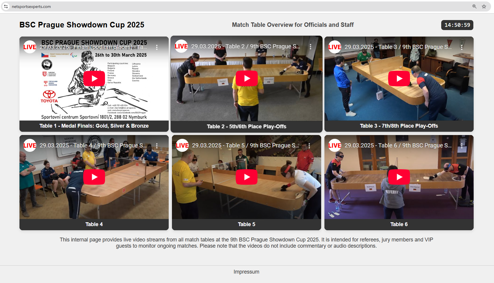

# Showdown Stream Overview

**Livestream-Übersicht für den 9. BSC Prague Showdown Cup 2025 in Nymburk, Tschechien**

Diese minimalistische Web-Oberfläche zeigt alle Livestreams der Tische auf einer Seite – perfekt für Schiedsrichter, Jury und VIP-Gäste.  
Kein Schnickschnack, aber eine laufende Uhr, klare Struktur und einfache Anpassung über eine Liste mit YouTube-IDs.

---

## 🏓 Hintergrund

Entstanden anlässlich des 9. BSC Prague Showdown Cups 2025.  
Das Ziel: Eine interne Übersicht aller laufenden Matches – möglichst einfach, responsive und auch auf Mobilgeräten gut nutzbar.

---

## 🚀 Features

- Übersicht aller Spieltische per YouTube-Embed (3×2 Grid)
- Live-Uhr in der Kopfzeile
- Klarer Hinweistext für Screenreader & Barrierefreiheit
- **Autoplay stumm** (kein Ton) für alle Streams
- **Watchdog**: prüft regelmäßig, ob ein Stream wirklich läuft, und startet/loaded ihn neu (z. B. wenn ein Stream erst später live geht oder der Player „hängen bleibt“)
- Click-Overlay: „Watch on YouTube“ öffnet den jeweiligen Stream in einem neuen Tab
- YouTube-IDs einfach im HTML anpassen

### Warum nicht mehr die ganz simple Lösung?

Die frühere Version nutzte nur statische `<iframe>`-Embeds. Das funktioniert grundsätzlich, hat aber im Event-Betrieb zwei Nachteile:

1. **Scheduled → Live**: Wenn ein Stream zum Zeitpunkt des Seitenaufrufs noch nicht live ist, startet er später oft **nicht zuverlässig von selbst**, ohne Reload.
2. **Langlauf-Stabilität**: Bei mehreren Tagen Laufzeit können einzelne Embeds „stehen bleiben“. Ohne API gibt es keine saubere Möglichkeit, den Player-Status zu prüfen und automatisch neu anzustoßen.

Deshalb nutzt diese Version die **YouTube IFrame Player API**: stummes Autoplay + Statusprüfung + automatischer Neustart.

---

## ▶️ Lokal starten

Da diese Seite die **YouTube IFrame Player API** nutzt, funktioniert ein direktes Öffnen per Doppelklick (`file://…/index.html`) je nach Browser nicht zuverlässig (Origin/Embed-Sicherheitschecks).
Starte die Seite daher lokal über einen kleinen Webserver:

### Windows (PowerShell / CMD)

```bat
cd C:\Users\...\Documents\Testwebsite
python -m http.server 8000
```

Danach im Browser öffnen:

```
http://localhost:8000/index.html
```

## 🔧 Konfiguration

Im Code findest du eine zentrale Stelle, an der du nur noch die YouTube-IDs ändern musst:

```javascript
        const youtubeStreams = [
            { id: "LWRiuhlMPgM", title: "Table 1" },
            { id: "O7fwD_AWTQ8", title: "Table 2" },
            { id: "oVaXhRaN8IY", title: "Table 3" },
            { id: "TxsH5VWBsiM", title: "Table 4" },
            { id: "Hu6Xmg-Qpw8", title: "Table 5" },
            { id: "tAWcDQUUgRI", title: "Table 6" }
        ];

```

## 🖼️ Screenshot



